# Explore and Predict the Spatio-Temporal relationship of Scotland based on SIMD and Housing prices

Spatial Data Science in Python — final assignment. The notebook
[`notebook/Scotland_SIMD_Houseprice.ipynb`](notebook/Scotland_SIMD_Houseprice.ipynb)
rolls the Scottish Index of Multiple Deprivation (SIMD) up to council area,
aligns it with Registers of Scotland (RoS) residential sale prices, explores the
spatial autocorrelation of both, and fits four regularised regression models to
relate deprivation to house prices — in both absolute and period-on-period
(difference) form.

---

## 1. Environment

The whole repository is managed with [`pixi`](https://pixi.sh). Every dependency
is declared in the root [`pixi.toml`](../pixi.toml) and pinned in
[`pixi.lock`](../pixi.lock). This assignment adds a few packages on top of the
course base — the spatial-econometrics stack (`spreg`, `spglm`, `mgwr`) and
`cvxopt` (the convex solver backing the regularised regression) — so you need to
re-sync the environment after pulling.

```bash
# from the repository root
pixi install        # creates / updates the env from pixi.toml + pixi.lock
```

`pixi install` is idempotent: run it again any time `pixi.toml` changes and it
will pull in the additional packages without rebuilding the rest.

Launch the notebook **from inside the `notebook/` folder** — the code resolves
data with relative paths (`../data`, `../figure`) and imports the helper module
via `sys.path.append("..")` (`from src.dictionary import ...`), so the working
directory must be `99_assignment/notebook/`:

```bash
cd 99_assignment/notebook
pixi run marimo edit Scotland_SIMD_Houseprice.ipy   # marimo (how it was authored)
# or
pixi run jupyter lab Scotland_SIMD_Houseprice.ipynb   # plain JupyterLab
```

`pixi run` auto-discovers the root manifest, so it works from the subdirectory.

---

## 2. Notebook flow

The notebook runs as a linear pipeline across four stages. **Stage 1** loads the
three SIMD years, canonicalises the council names (each year spells them
differently), and dissolves the Data Zones up to council area with a
polygon-count (volume) weighting before assigning weighted deciles; it then
explores spatial autocorrelation (KNN elbow correlograms and a combined
queen ∪ KNN-3 LISA) and computes the cross-year rank differences. **Stage 2**
reads the RoS *C6* sheet, inflation-adjusts every price to a 2011 base, and
volume-weights the mean/median sale price over the four-year window preceding
each SIMD year. **Stage 3** joins the dissolved SIMD ranks to the
volume-weighted prices into the modelling feature set (plus its differenced
twin). **Stage 4** fits four elastic-net regularised models — absolute vs.
difference × standard OLS vs. spatial-lag — each tuned to minimise validation
MSE, and maps the residuals, their LISA clusters, residual boxplots and council
fixed effects. Intermediate and feature data, and every figure, are written back
to disk as the pipeline runs.

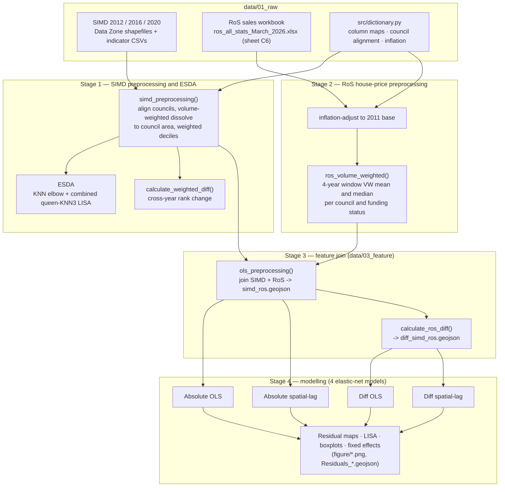

---

## 3. Preparing the dataset

The notebook reads everything from `data/01_raw/`. **You must create this folder
and drop the raw files into it yourself** — `data/` is git-ignored, so the raw
inputs are never committed. Everything downstream is created for you: the first
code cell runs `mkdir(parents=True, exist_ok=True)` for `data/02_intermediate`,
`data/03_feature` and `figure`, and the preprocessing cells write the
intermediate / feature GeoJSONs into them on the first run (and re-read them on
subsequent runs, so the heavy steps only happen once).

Create the raw tree so it matches the paths hard-coded in the notebook:

```
99_assignment/data/01_raw/
├── simd2012_withgeog/
│   ├── DZ_2011_EoR_Scotland.shp        # + .dbf .shx .prj sidecars
│   └── simd2012_data_00410767_plusintervals.csv
├── simd2016_withgeog/
│   ├── sc_dz_11.shp                     # + .dbf .shx .prj sidecars
│   └── simd2016_withinds.csv
├── simd2020_withgeog/
│   ├── sc_dz_11.shp                     # + .dbf .shx .prj sidecars
│   └── simd2020_withinds.csv
└── ros_all_stats_March_2026.xlsx        # Registers of Scotland, sheet "C6"
```

* **SIMD** — Data Zone boundary shapefiles **and** the matching indicator tables
  for the 2012, 2016 and 2020 releases (Scottish Government / `gov.scot` SIMD
  downloads). A shapefile is a multi-file set — keep the `.shp` together with its
  `.dbf`, `.shx` and `.prj` sidecars.
* **RoS** — the Registers of Scotland residential-property statistics workbook;
  the notebook reads sheet **C6** (*Median, mean, volume and value of all
  residential market value property sales by funding status and local
  authority*).

After the raw files are in place, run the cells top to bottom. You should end up
with:

```
data/02_intermediate/   simd_{2012,2016,2020}.geojson, DissolveSIMD_{…}.geojson, simd_diff_{1216,1620}.geojson
data/03_feature/        simd_ros.geojson, diff_simd_ros.geojson, Residuals_*.geojson
figure/                 the PNGs shown below
```

---

## 4. Results and plots

Interpretations below are lifted directly from the notebook's markdown cells.

### Stage 1 — SIMD preprocessing & ESDA

Combined queen ∪ KNN-3 LISA clusters of the absolute weighted ranks, per year.

*2012*

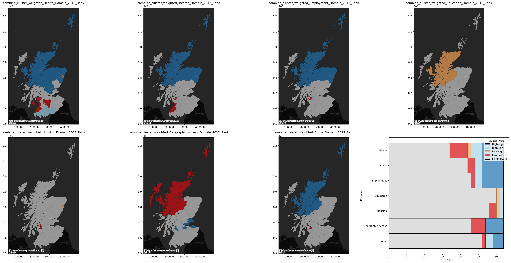

*2016*

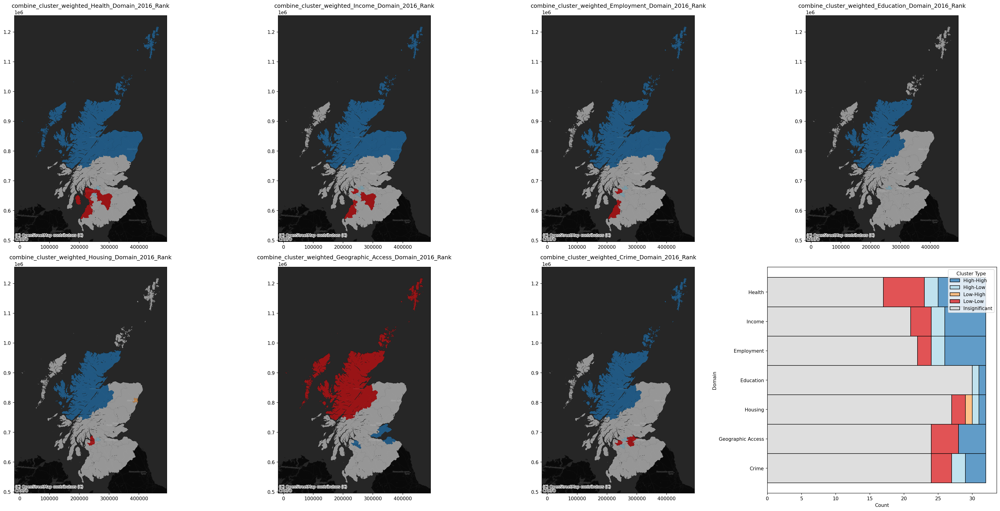

*2020*

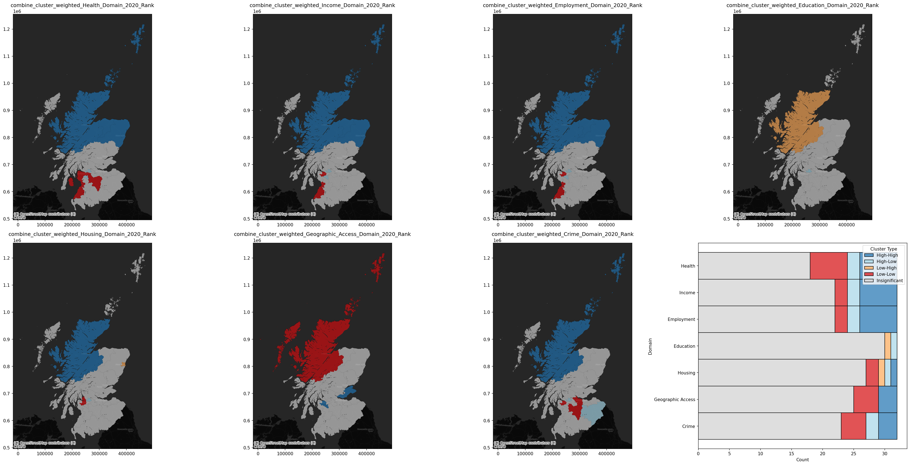

Absolute rank trajectories vs. per-period differences:

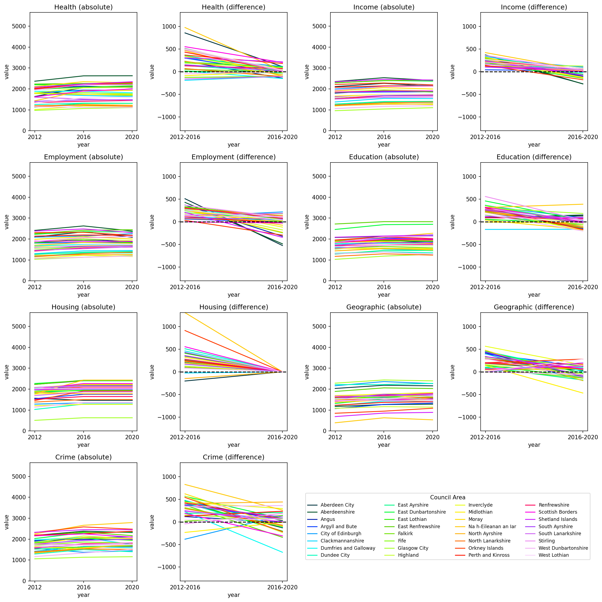

LISA clusters of the per-period rank *differences*.

*2012 → 2016*

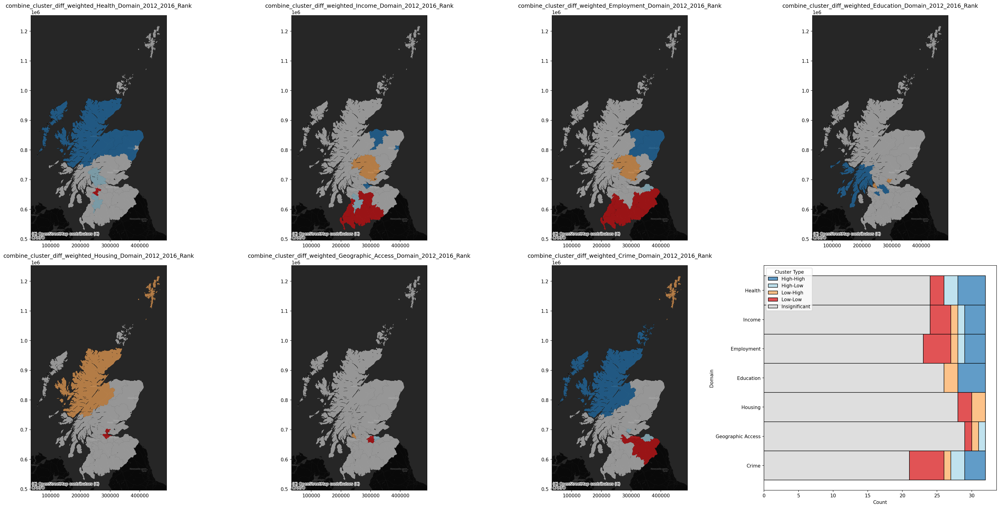

*2016 → 2020*

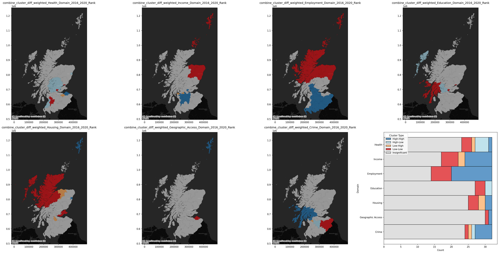

> **Stage 1: SIMD preprocessing summary**
>
> I have rolled-up the SIMD data into Council Areas, using a volume weighted approach for each year. I calculated the Moran's I for each domain using a lower critical level of 0.1.
>
> **1. Absolute numbers**
> 1. For all periods, the Health, Income, and Employment consistently has the highest proportion of councils with statistical significance clustering.
> 2. The Councils of Highlands, Shetlands, and Orkney Islands have experienced consistent clustering for Health, Income, Crime and Employment domains, being above average and significance in their neighbouring effects. This suggests that for many of the northern councils, their spatial relations are much more pronounced and less random than the rest of Scotland. Unsurprisingly since the Highlands and Islands have always been closely intertwined economically and culturally.
> 3. For the council of South Ayrshire and East Dunbartonshire in Western Central Belt, they experienced consistently Low-Low clustering for Health, Income, and Employment.
>
> **2. Relative differences**
> 1. This is a significantly more interesting metric. Looking at the relative lineplots, we saw a smaller overall increase of ranking for Health, Education and Geographic Access for 2016-2020 when compared to 2012-2016, while many other domains experienced a reduction in improvement for most councils. Looking at cluster for diff for Highlands, Shetlands, and Orkney Islands, although absolute rankings suggests they are consistently above average for Income and Employment, relative differences suggest that high absolute spatial relationship do not translate to relative. Particularly for Income and Employment, the Shetland and Orkney Islands experiencing negative changes with significant negative changes in the surrounding areas. I.e. quality of life for Income and Employment domain are high but worsening.
> 2. Meanwhile for Income, Employment, and Crime 2012-2016, relative differences in Low-Low clustering have gain grounds in the borders of Scotland, suggesting lower than average changes begets lower changes in these domains in the surround areas. But this was not significant in absolute ranking for 2012 and 2016. This might suggest that the border regions are experiencing increase in crime, and negative income and employment outcome caused by neighbouring effects temporarily.
> 3. The largest change came from Income, Employment, and Crime. We saw a reversal in changes trend particularly pronounced for employment where Dumfries and Galloway had lower than average changes to higher than average changes.
>
> **Overall:** The result might indicate that the more affluent rural areas in the north of Scotland with strong autocorrelation might be experience negative changes recently. While more economically deprived areas of Western Scotland (Ayrshire) have not experienced much changes at all, with the rest of the central belt being a mixed bag results, with central Scotland experiencing improvement in Income and Employment for 2016-2020. The borders and Dumfries and Galloway are also inconsistent. Excluding spatial autocorrelation, we generally saw stagnation with 2016-2020 saw lower positive changes in improvement or worsening compared to 2012-2016. Growth in quality of life have generally reduced, with Crime seeing mixed result. Most significant was housing where there were little to no changes in ranking for 2016-2020. Employment and Income were both trending into the negative with 2016-2020, suggesting that income and employment metrics have worsen overall.

### Stage 2 — House purchase price preprocessing

> I will be using the ROS house median house price dataset sheet C6: Median, mean, volume and value of all residential market value property sales by funding status and local authority: Scotland, since 2004, calendar year data

Inflation-adjusted (2011 base) price trends by funding status, with the SIMD
years marked:

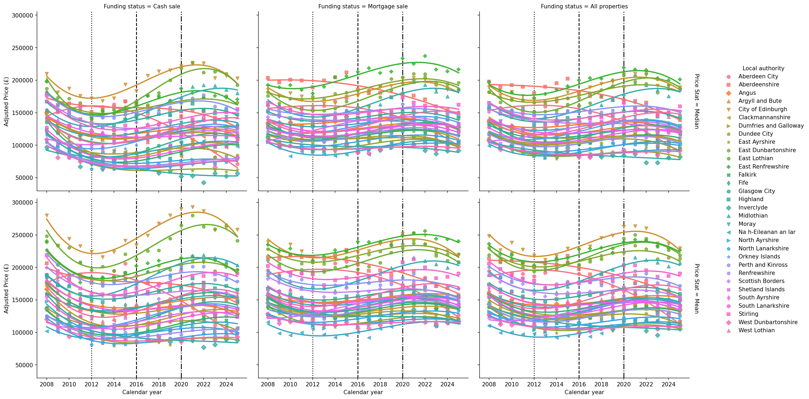

Volume-weighted median price, mapped across funding status and four-year window:

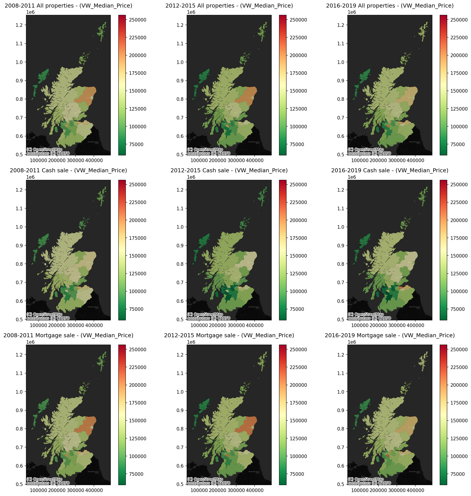

### Stage 4 — Modelling

> I will perform 4 linear regression models:
> 1. OLS with absolute SIMD and ROS Funding Status
> 2. Spatial Regression with absolute SIMD and ROS Funding Status
> 3. OLS with relative SIMD and ROS Funding Status
> 4. Spatial Regression with relative SIMD and ROS Funding Status
>
> All models are fitted with elastic-net regularisation and tuned to minimise the MSE on a 20% validation set.

Actual vs. predicted price, residuals and residual LISA — **absolute** models.

*Standard OLS*

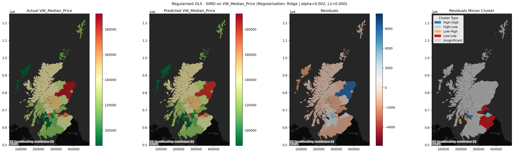

*Spatial Regression*

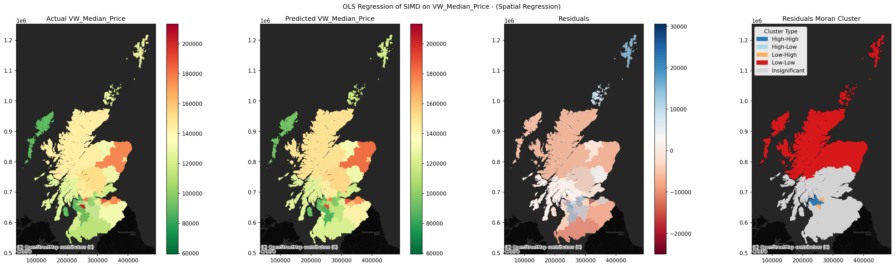

…and the **relative (diff)** models.

*Standard OLS (diff)*

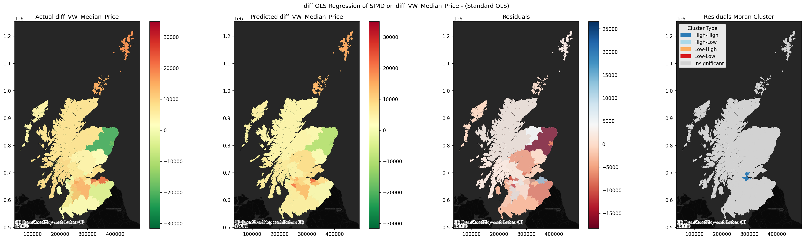

*Spatial Regression (diff)*

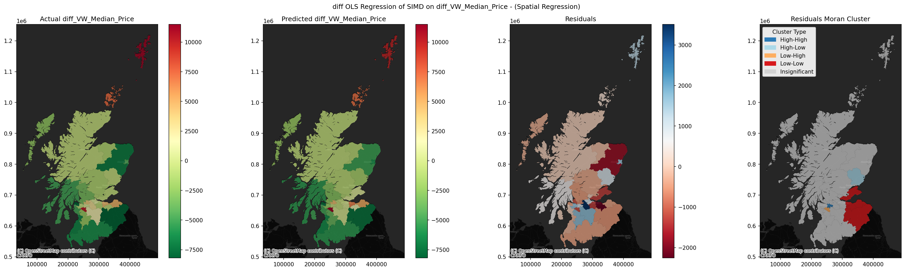

Per-council residual spread, Standard OLS vs. Spatial Regression.

*Absolute*

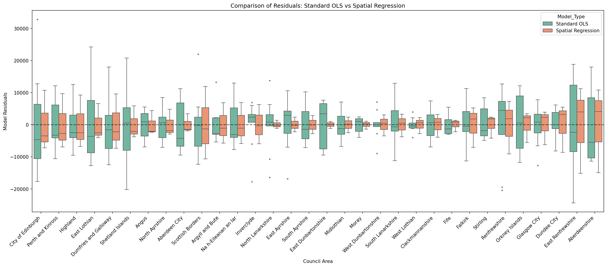

*Difference*

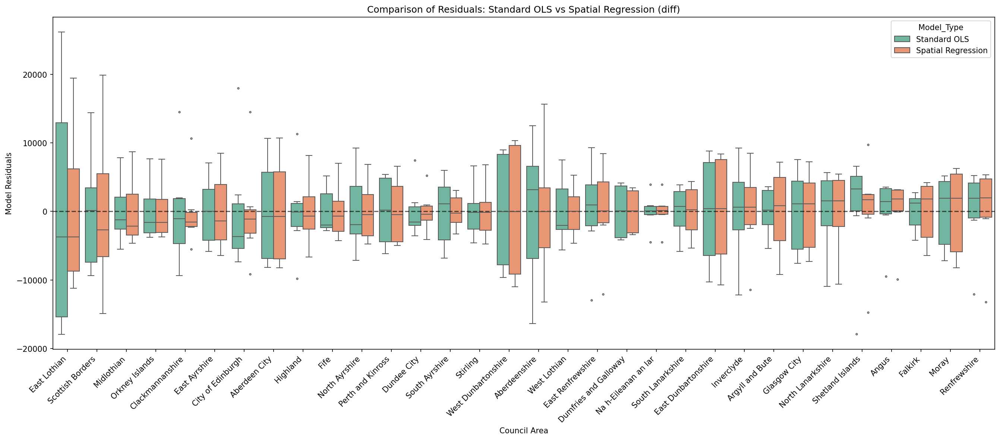

Council fixed effects (side by side):

| Absolute | Difference |
| --- | --- |
| 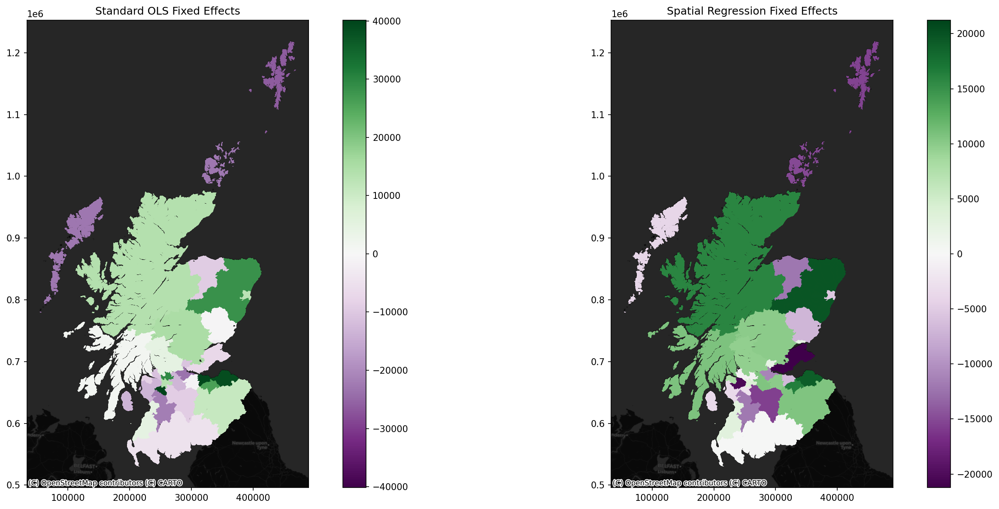 | 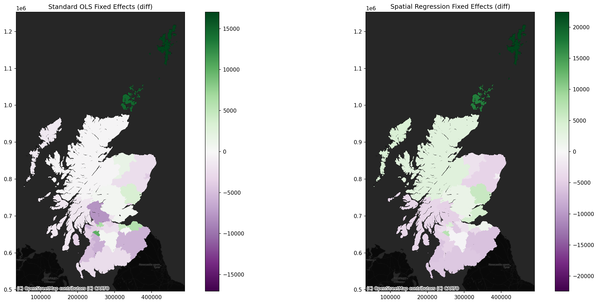 |

> **OLS and spatial regression results**
>
> > Outcomes and statistics might vary slightly when the cells are re-run and models are re-fitted.
>
> In total, 4 regularised models were fitted against Volume Weighted Median Price and diff Volume Weighted Median Price:
> 1. OLS with absolute SIMD and ROS Funding Status
> 2. Spatial Regression with absolute SIMD and ROS Funding Status
> 3. OLS with relative SIMD and ROS Funding Status
> 4. Spatial Regression with relative SIMD and ROS Funding Status
>
> > Residuals are defined as Actual - Predicted.
> > Overprediction is Actual < Predicted (negative residual); underprediction is Actual > Predicted (positive residual).
> > Critical value is evaluated at 0.1 significance level, more relaxed because of the heavily aggregated nature of the underlying data
> > The mapped residual was calculated using a volume weighted mean across Actual, Predicted, and Residual. This volume weighted mean should be a more accurate reflection of median price because prices because there are significant difference in Mortgage and Cash Sales number in aggregated year_range. This will differ from the median residual seen on the boxplot.
>
> **Absolute**
>
> 1. **OLS with absolute SIMD and ROS Funding Status**
>    - R2 = 0.924
>    - Adjusted R2 = 0.904
>    - Regularisation: Ridge (alpha = 0.002, L1 weight = 0)
>    - Top 3 SIMD variables, None are statistically significant: Geographic Access (1.303), Health (0.894), Employment (0.683)
>    - ROS Funding Status, None are statistically significant: Mortgage Sales (0.186) > Cash Sales (-0.77)
>    - Moran cluster of the residuals suggests clustering of Median Price underprediction (High-High) in Inverclyde, East Renfrewshire, Renfrewshire, and Glasgow and overprediction (Low-Low) in Fife, Midlothian, and Borders.
>
> 2. **Spatial Regression with absolute SIMD and ROS Funding Status**
>    - R2 = 0.927
>    - Adjusted R2 = 0.904
>    - Regularisation: Ridge (alpha = 0.002, L1 weight = 0)
>    - Top 3 SIMD variables, None are statistically significant: Employment (1.607), Geographic Access (1.424), Health (0.724)
>    - Top 3 SIMD lag variables, Health_lag is statistically significant: Health_lag (1.992) (p=0.048), Education_lag (0.575), Geographic Access (0.181)
>    - ROS Funding Status, None are statistically significant: Mortgage Sales (0.081) > Cash Sales (-0.128)
>    - Moran cluster of the residuals have similar results to OLS model. Underpredicttion (High-High) in Inverclyde, East Renfrewshire, Renfrewshire, Glasgow, with an addition of South Lanarkshire and overprediction (Low-Low) in Fife, Midlothian, and Borders with an addition of East Lothian.
>
> Reviewing the residual boxplots. There are no obvious observation where the addition of spatial features could reduce the residual variance.
>
> **Relative**
>
> 3. **OLS with relative SIMD and ROS Funding Status**
>    - R2 = 0.605
>    - Adjusted R2 = 0.424
>    - Regularisation: Elastic-Lasso (alpha = 0.483, L1 weight = 0.9)
>    - Top 3 SIMD variables, None are statistically significant: Employment (1.507), Health (0.78), Housing (-0.250)
>    - ROS Funding Status, Cash Sales is statistically significant: Mortgage Sales (0.937) > Cash Sales (-2.173) (p=0.032)
>    - Moran cluster of the residuals for the relative OLS model suggest underprediction (High-High) in Glasgow and Orkney and overprediction (Low-Low) for Argyll and Bute.
>
> 4. **Spatial Regression with relative SIMD and ROS Funding Status**
>    - R2 = 0.727
>    - Adjusted R2 = 0.572
>    - Regularisation: Elastic (alpha = 0.08, L1 weight = 0.6)
>    - Top 3 SIMD variables, Employment is statistically significant: Employment (1.796) (p=0.076), Health (0.576), Education (0.047)
>    - Top 3 SIMD lag variables, None are statistically significant: Health_lag (1.177), Employment_lag (0.631), Education_lag (0.197)
>    - ROS Funding Status, None are statistically significant: Mortgage Sales (1.269) > Cash Sales (-0.559)
>    - Moran cluster of the residuals suggests similar results for underprediction of Orkney and Glasgow, but overprediction of Argyll and Bute was removed and addition of Edinburgh and Borders.
>
> Reviewing the resdiual boxplots. The spatial regression for relative models seems to be able to slightly reduce variance for the most overpredicted councils (Borders, Edinburgh, and East Lothian), but increases the variance for those with the smallest median residuals.
>
> **Overall interpretation**
>
> Overall, spatial models do have a slight improvements when compared to non spatial OLS. The first 2 models that fitted the absolute SIMD and ROS values to median price showed high positive correlation when compared to the latter 2 models which fitted the relative diff in SIMD and ROS values to diff in median price.
>
> Interestingly, in both relative and absolute models. Introduction of spatial lags for SIMD variables seems to change the ordering of the highest t-score, but statistical significance are scarce (only Health_lag for absolute spatial regression and Employment for relative spatial regression). It is inconclusive whether spatial models have any better predictive power when focusing on specific SIMD variables. None of the ROS Funding Status variables are statistically significant either.
>
> Spatial similarity in significance of residual clusttering between the 2 absolute and spatial relative model suggests that only when spatial features were included in the diff model does it agree with the overprediction. All 4 models have classed absolute and relative underprediction in Glasgow.
>
> Absolute model underprediction is concetrated in historically deprived councils in West of Scotland, Glasgow, Inverclyde, Renfrewshire, and East Renfrewshire. Aberdeenshire (although not spatially significant) is an anomaly but we saw a sharp anticyclical pattern in drop of SIMD ranks and house prices. While absolute models overprediction are concentrated in East of Scotand, Fife, Edinburgh, Midlothian, and Borders. which are historically more affluent with the exception of Fife.
>
> While Volume Weighted Median Price have been decreasing for most councils, with the exception of the Islands, and parts of the central belt. The residual and the clustering of the residuals suggests that our model largely overpredicts the reduction in median price. The clustering of the residual suggests underprediction of Glasgow and Orkney which had a increase in median price. When spatial features were added saw a underpredicted East Lothian which expienced increase in price and underprediction of Highland which saw a decrease in price. Overprediction of the spatial relative models agrees with the absolute models.
>
> While the models struggle to explain the SIMD variables and ROS variables to be predictive, as there were not a lot of clear agreement between the absolute and relatives, we could agree that spatial features are important when fitting the relatives for better model performance and agreement with the absolute models.
